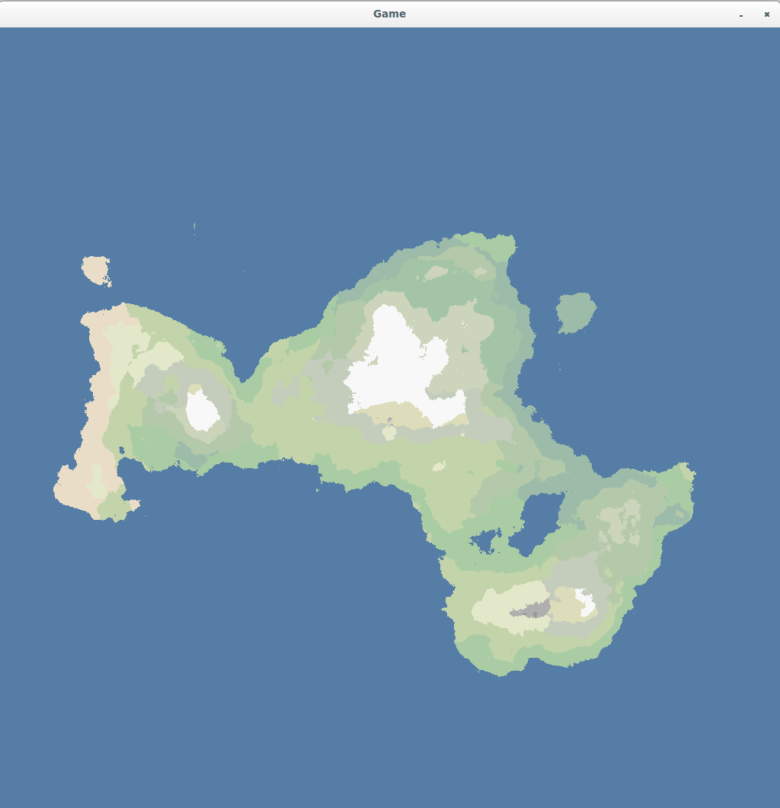

# README

Java implementation of the Diamond Square Algorithm (see [wiki](http://en.wikipedia.org/wiki/Diamond-square_algorithm)).
The program uses the lwjgl to display the resulting map. 

# RESULTS

Some screenshots :

